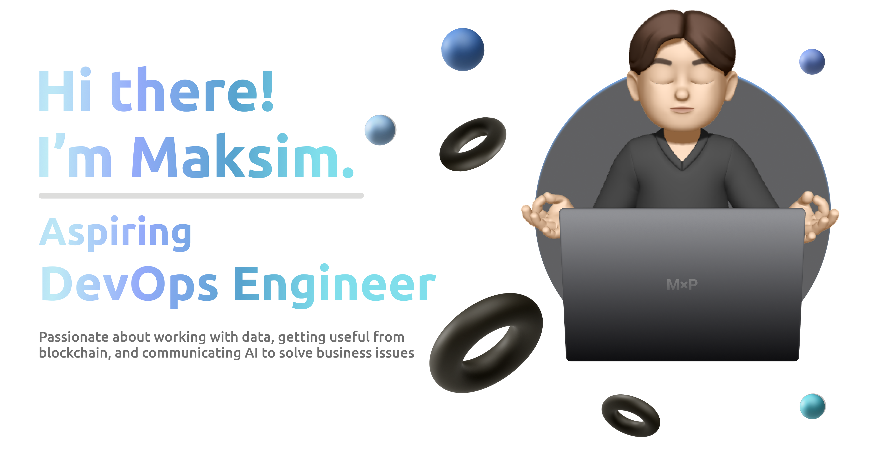

<h4>This is the place, where my code goes public and blunders become legendary 🚀🤣</h4>

<ul>
    <li style="margin-bottom: 10px;">🔭 Currently, I'm crafting my personal web-page</li>
    <li style="margin-bottom: 10px;">🌱 Diving into Flutter & Golang technologies</li>
    <li style="margin-bottom: 10px;">⚡ Excited about blockchain & AI technologies</li>
</ul>

    <h3>🔗&nbsp;Connect with me</h3>
    <ul>
        <!-- <li style="margin-bottom: 10px;">✨ Visit my Dev.to blog</li> -->
        <li style="margin-bottom: 10px;">
            💬 Preffered ways to contact:
                 <!-- & 
                 -->
        </li>
    </ul>
    

        
        
        
        
        
        <!-- 
        
        
         -->
    

    <h3>✨&nbsp;About Me</h3>
    

        🧿 At just 20 years old, I've built a strong foundation as a Python backend developer. My journey into DevOps has been immersive, allowing me to delve deep into tools and methodologies that define the domain. My hands-on experience isn't confined to just one area: from orchestrating containers with Docker and Kubernetes, managing continuous integration and deployment through CI/CD pipelines, to leveraging cloud platforms for scalable solutions, I've covered a broad spectrum. Additionally, my familiarity with various databases equips me to handle data-driven projects with finesse. Beyond the technical, I've taken on leadership roles, spearheading teams and navigating the complexities of project management. This has instilled in me a clear understanding of team dynamics and the multifaceted challenges that leadership positions often entail.
    

    

        🚀 Blockchain, artificial intelligence, and data science aren't just areas of interest for me; they're domains where I actively invest my time and energy. I've dived into the intricacies of blockchain technology, understanding the nuances that drive decentralized systems. In the realm of artificial intelligence, I've worked to unravel the complexities behind machine learning algorithms and neural networks. With data science, it's not just about analyzing data sets for me; it's about comprehending the stories they tell and the patterns they reveal. As the tech landscape constantly evolves, I not only strive to keep pace but also to harness the latest advancements. My depth of understanding in these fields allows me to be a valuable contributor to any team, bringing insights that go beyond the surface.
    

    

        🔍 My pursuits don't stop at traditional development & research. The emergence of NFTs and other blockchain technologies has captured my attention, and I see immense potential in their applications within education. By understanding the inherent properties and capabilities of NFTs, I'm exploring ways to seamlessly integrate them into the educational ecosystem, aiming to reshape and enrich the learning experience for students. Whether it's to authenticate digital certificates, create unique educational assets, or develop new teaching methodologies based on blockchain's transparent and immutable nature, I'm at the forefront of merging cutting-edge technology with educational paradigms. This fusion of academia and technology in my work adds an innovative layer to the projects I undertake.
    

<!-- 

    <h3>📊&nbsp;This week I spent my time on</h3>
    

 -->

<!-- 

    
<h3>🛠️&nbsp;Tech&nbsp;stack&nbsp;and&nbsp;Tools</h3>

     
    <code>Coming soon...</code>

 -->

    
<h3>📈&nbsp;Languages&nbsp;&&nbsp;Stats</h3>

     
    

        <picture name="github stats">
            <source
                srcset="https://github-readme-stats.vercel.app/api?username=mxpanf&show_icons=true&theme=dark"
                media="(prefers-color-scheme: dark)"
            />
            <source
                srcset="https://github-readme-stats.vercel.app/api?username=mxpanf&show_icons=true&hide=issues&theme=default"
                media="(prefers-color-scheme: light), (prefers-color-scheme: no-preference)"
            />
            
        </picture>
        <picture name="top langs stats">
            <source
                srcset="https://github-readme-stats.vercel.app/api/top-langs/?username=mxpanf&langs_count=8&layout=compact&theme=dark"
                media="(prefers-color-scheme: dark)"
            />
            <source
                srcset="https://github-readme-stats.vercel.app/api/top-langs/?username=mxpanf&langs_count=8&layout=compact&theme=default"
                media="(prefers-color-scheme: light), (prefers-color-scheme: no-preference)"
            />
            
        </picture>
    

    <!-- 

        
    
 -->

  <code>Feel free to ⭐ and 🍴 this repo.</code>

